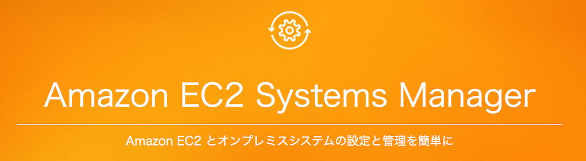
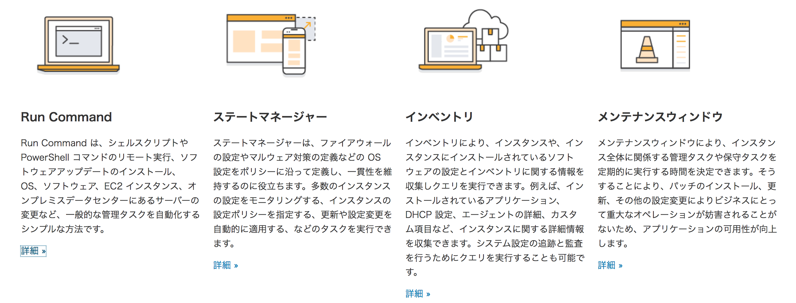
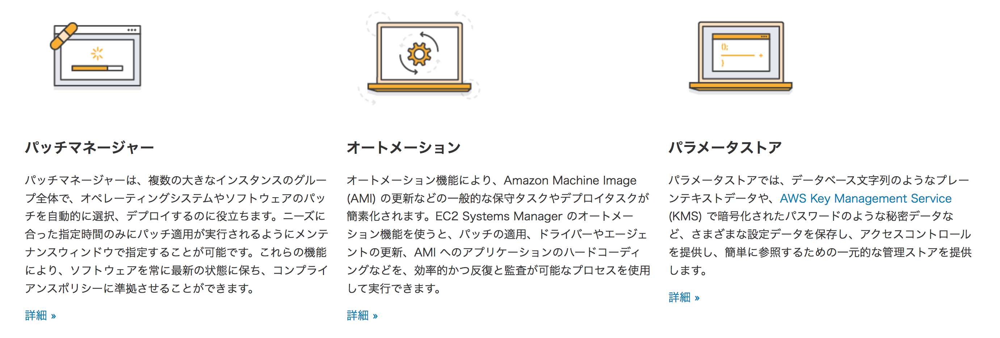
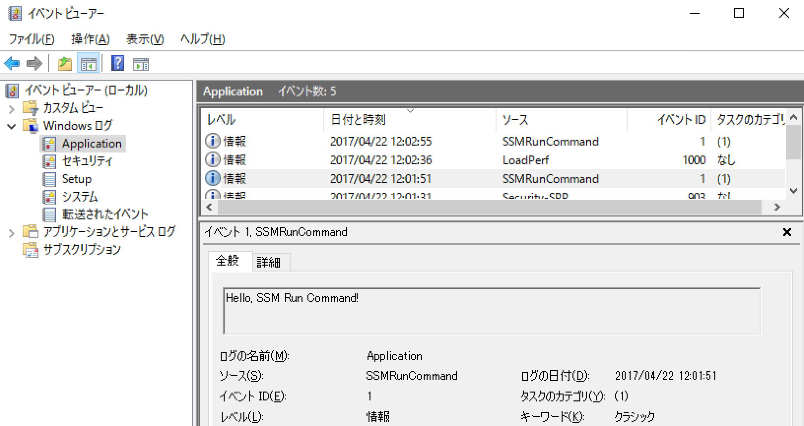

# SSM Run Command で遊ぶ

## 第28回シェル芸勉強会 大阪サテライトLT
## 2017/4/22
## so

>>>

Powered by
* [reveal.js](https://github.com/hakimel/reveal.js/)
* [GitHub Pages](https://horo17.github.io/aws-nest-call-slide/)

>>>

## `$ whoami`


* so
* インフラエンジニア (AWS)
* [@3socha](https://twitter.com/3socha)

---

## [EC2 System Manager](https://aws.amazon.com/jp/ec2/systems-manager/)



- 旧称 SSM (Simple System Manager)

>>>

## System Manager 機能



>>>

## System Manager 機能



>>>

## SSM Run Command

* SSM Agent が SSM エンドポイントと通信し、リモートからコマンドを実行
  * Linux : [要 Agent インストール](http://docs.aws.amazon.com/ja_jp/systems-manager/latest/userguide/ssm-agent.html)
  * Windows : WS2016 / 2016年11月以降に公開された WS2003~WS2012R2 のイメージにはインストール済み
  * セキュリティグループ : OutBound TCP/443 を許可

>>>

## 実行する側の必要権限

* AmazonEC2RoleforSSM ポリシーを参考に
  * s3 PutObject / GetObject が無制限に付いてるのは気にした方が良いかも

```json
{
    "Version": "2012-10-17",
    "Statement": [
        {
            "Effect": "Allow",
            "Action": [
                "ssm:DescribeAssociation",
                "ssm:GetDeployablePatchSnapshotForInstance",
                "ssm:GetDocument",
                "ssm:GetParameters",
                "ssm:ListAssociations",
                "ssm:ListInstanceAssociations",
                "ssm:PutInventory",
                "ssm:UpdateAssociationStatus",
                "ssm:UpdateInstanceAssociationStatus",
                "ssm:UpdateInstanceInformation"
            ],
            "Resource": "*"
        },
        {
            "Effect": "Allow",
            "Action": [
                "ec2messages:AcknowledgeMessage",
                "ec2messages:DeleteMessage",
                "ec2messages:FailMessage",
                "ec2messages:GetEndpoint",
                "ec2messages:GetMessages",
                "ec2messages:SendReply"
            ],
            "Resource": "*"
        },
        {
            "Effect": "Allow",
            "Action": [
                "cloudwatch:PutMetricData"
            ],
            "Resource": "*"
        },
        {
            "Effect": "Allow",
            "Action": [
                "ec2:DescribeInstanceStatus"
            ],
            "Resource": "*"
        },
        {
            "Effect": "Allow",
            "Action": [
                "ds:CreateComputer",
                "ds:DescribeDirectories"
            ],
            "Resource": "*"
        },
        {
            "Effect": "Allow",
            "Action": [
                "logs:CreateLogGroup",
                "logs:CreateLogStream",
                "logs:DescribeLogGroups",
                "logs:DescribeLogStreams",
                "logs:PutLogEvents"
            ],
            "Resource": "*"
        },
        {
            "Effect": "Allow",
            "Action": [
                "s3:PutObject",
                "s3:GetObject",
                "s3:AbortMultipartUpload",
                "s3:ListMultipartUploadParts",
                "s3:ListBucketMultipartUploads"
            ],
            "Resource": "*"
        },
        {
            "Effect": "Allow",
            "Action": [
                "s3:ListBucket"
            ],
            "Resource": "arn:aws:s3:::amazon-ssm-packages-*"
        }
    ]
}
```

---

## Windows ホストの PowerShell からイベントログに書き込む SSM Run Command

```sh
$ aws ssm send-command \
--document-name "AWS-RunPowerShellScript" \
--instance-ids "i-xxxxxxxxxxxwindws" \
--parameters '{
  "commands": [
    "$EventSource=\"SSMRunCommand\"",
    "if ([System.Diagnostics.EventLog]::SourceExists($EventSource) -eq $false){",
    "    New-EventLog -LogName Application -Source $EventSource",
    "}",
    "Write-EventLog -LogName Application -EntryType Information -Source $EventSource -EventId 1 -Message \"Hello, SSM Run Command!\""
  ],
  "executionTimeout": [
    "30"
  ]
}' \
--timeout-seconds 30 \
--region ap-northeast-1
```

* コマンドの出力が必要な場合は S3 に吐いておかないと残らない
* send-command 自体はすぐ終了するため、実行の完了を待ち合わせる必要あり

>>>

## Lambda (Python 3.6) から実行

```python
import boto3

def lambda_handler(event, context):
    client = boto3.client('ssm')
    client.send_command(
        DocumentName=event['DocumentName'],
        InstanceIds=event['InstanceIds'],
        Parameters=event['Parameters'],
    )
    return None
```

* 受け取った `event` からパラメータを引っ張って `send_command()` を単純に実行するのみ

>>>

## Windows ホストの PowerShell からイベントログに書き込む SSM Run Command を実行する Lambda Function を実行する

```sh
$ aws lambda invoke \
  --function sample-function \
  /dev/stdout \
  --region ap-northeast-1 \
  --payload '{
  "DocumentName": "AWS-RunPowerShellScript",
  "InstanceIds": [
    "i-xxxxxxxxxxxwindws"
  ],
  "Parameters": {
    "commands": [
      "$EventSource=\"SSMRunCommand\"",
      "if ([System.Diagnostics.EventLog]::SourceExists($EventSource) -eq $false){",
      "    New-EventLog -LogName Application -Source $EventSource",
      "}",
      "Write-EventLog -LogName Application -EntryType Information -Source $EventSource -EventId 1 -Message \"Hello, SSM Run Command!\""
    ],
    "executionTimeout": [
      "30"
    ]
  }
}'
```

>>>

## Windows ホストの PowerShell からイベントログに書き込む SSM Run Command を実行する Lambda Function を Linux ホストのシェルから実行する SSM Run Command

```sh
$ aws ssm send-command \
--document-name "AWS-RunShellScript" \
--instance-ids "i-xxxxxxxxxxxlinux" \
--parameters '{
  "commands": [
    "aws lambda invoke --function sample-function /dev/stdout --region ap-northeast-1 --payload \"{\\\"DocumentName\\\":\\\"AWS-RunPowerShellScript\\\",\\\"InstanceIds\\\":[\\\"i-xxxxxxxxxxxwindws\\\"],\\\"Parameters\\\":{\\\"commands\\\":[\\\"\\$EventSource=\\\\\\\"SSMRunCommand\\\\\\\"\\\",\\\"if ([System.Diagnostics.EventLog]::SourceExists(\\$EventSource) -eq \\$false){\\\",\\\"New-EventLog -LogName Application -Source \\$EventSource\\\",\\\"}\\\",\\\"Write-EventLog -LogName Application -EntryType Information -Source \\$EventSource -EventId 1 -Message \\\\\\\"Hello, SSM Run Command!\\\\\\\"\\\"],\\\"executionTimeout\\\":[\\\"30\\\"]}}\""
  ],
  "executionTimeout": [
    "30"
  ]
}' \
--timeout-seconds 30 \
--region ap-northeast-1
```

>>>



エスケープがんばればいけないこともない (LTまでには解けなかった)

---

## SSM Run Command

* 複数のホストに並列にコマンドを投げられる
* CloudTrail で記録を残せるので、誰がいつ何を実行したかを追跡できる
* Windows にも Linux にもコマンドを投げられる
* 実行結果を取ってくるのは割と面倒くさい
